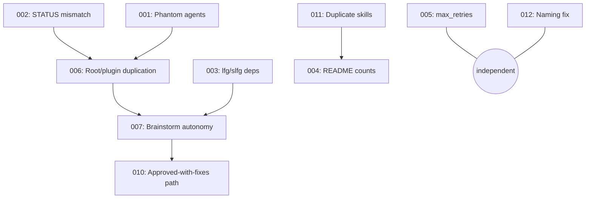

# Fix All 15 Documented Plugin Issues

## Enhancement Summary

**Deepened on:** 2026-02-15
**Sections enhanced:** 15 issues across 3 phases
**Research agents used:** architecture-strategist, security-sentinel, agent-native-reviewer, code-simplicity-reviewer, pattern-recognition-specialist, performance-oracle, best-practices-researcher, spec-flow-analyzer

### Critical Plan Revisions From Deepening

1. **Issue 006 REVISED:** Do NOT use thin stubs — they break Antfarm agent loading and create a 4x context regression. Instead, fix divergence directly in AGENTS.md files and make plugin commands the authoritative source that agents copy from.
2. **Issue 010 REVISED:** Must also add `{{issues}}` to work step's `input:` template in workflow.yml, otherwise issues are silently discarded on `needs_fixes` routing.
3. **Issue 007 REVISED:** Use explicit `ANTFARM_MODE` environment variable instead of `{{issues}}` heuristic for mode detection. The heuristic is ambiguous and relies on unverified template substitution behavior.
4. **Issue 003 REVISED:** lfg/slfg rewrite must include the compound step, failure handling per-step, and support for three-way review decisions — not just a flat sequential list.
5. **Issue 012 DESCOPED:** Drop command file renames (12+ cross-references, cosmetic only). Only fix the skill name/directory mismatch.
6. **Issue 014 DESCOPED:** Drop orchestrating-swarms split (already `disable-model-invocation: true`, no context budget impact).
7. **Dependency graph fixed:** Issue 005 (max_retries) is now independent/Phase 1, not chained behind Issue 010.
8. **Security hardened:** Branch name regex tightened (must start alphanumeric, block `..`, max length). Python path validation uses `commonpath()` not just `realpath()`. Two additional Python files added to scope.

### New Considerations Discovered

- Thin stubs shift instruction-to-data ratio in favor of user-controlled input, weakening prompt injection resistance
- `needs_fixes` retry path may have its own counter independent of `max_retries`, circumventing the safety reduction
- `.gitignore` should include credential patterns (`*.pem`, `*.key`, `rclone.conf`)
- `$from_branch` parameter in worktree-manager.sh receives no validation at all despite being passed to `git checkout`
- `gemini_images.py` (the library) and `multi_turn_chat.py` also need path validation — not just the 3 CLI scripts
- `/agent-native-audit` command missing from README commands table

---

## Overview

The compound-engineering plugin v2.31.0 has 15 documented issues discovered during a comprehensive 7-agent code review. These range from P1 critical runtime failures to P3 quality improvements. This plan addresses all 15 in dependency order across 3 phases.

**Source:** `todos/001-015-*.md` and `docs/solutions/code-review/multi-agent-plugin-review-findings.md`

## Problem Statement

The plugin was vendored from a local cache into a standalone repository without a validation pass. This introduced:

- **5 P1 Critical issues** that block autonomous workflow execution (phantom agents, STATUS mismatch, broken commands, incorrect docs, unsafe retry limits)
- **5 P2 Important issues** that degrade reliability and security (duplication, blocked autonomy, curl|bash, no gitignore, no minor-fix path)
- **5 P3 Nice-to-Have issues** that reduce quality and maintainability (duplicate skills, naming inconsistencies, shell hardening, context bloat, Python duplication)

**Total estimated effort:** ~19 hours (revised down from ~22.5h after descoping command renames and orchestrating-swarms split)

## Proposed Solution

Fix all 15 issues in 3 phases, ordered by priority and dependency. Each phase is independently shippable.

## Technical Approach

### Dependencies Between Issues



### Research Insights: Dependency Graph

**Revision from architecture-strategist:** Issue 005 (max_retries) was incorrectly chained behind Issue 010 (needs_fixes path). max_retries is a P1 safety fix that should ship immediately — it has no dependency on the needs_fixes feature. Moved to Phase 1 as independent item.

**Revision from security-sentinel:** Autonomous mode detection (Issue 007) has a hard security dependency on max_retries reduction (Issue 005). Autonomous mode must NOT ship without the retry limit in place. These are not ordered sequentially, but must ship together.

**Key ordering constraints:**
- Fix STATUS mismatch (002) and phantom agents (001) before deduplicating root/plugin (006)
- Fix autonomy (007) before adding needs_fixes path (010)
- Issues 005, 008, 009, 012 are independent — can be done in any order
- Issues 007 and 005 must ship together (safety linkage)

### Implementation Phases

#### Phase 1: Critical Runtime Fixes (P1) — ~4 hours

These 5 fixes unblock autonomous workflow execution. Each is independent and can be done in parallel.

##### 1.1 Remove Phantom Agent References (Issue 001)

**Problem:** `.claude/commands/workflows/review.md` references 5 agents that don't exist: `dependency-detective`, `code-philosopher`, `devops-harmony-analyst`, `rails-turbo-expert`, `cora-test-reviewer`.

**Solution:** Remove the 5 phantom references from the parallel agent list. The remaining 9 agents (kieran-rails-reviewer, dhh-rails-reviewer, git-history-analyzer, pattern-recognition-specialist, architecture-strategist, security-sentinel, performance-oracle, data-integrity-guardian, agent-native-reviewer) provide comprehensive coverage.

**Files:**
- [ ] `.claude/commands/workflows/review.md` — Remove phantom agent entries from parallel agent list. Remove the conditional turbo check that referenced the non-existent `rails-turbo-expert`.
- [ ] `.claude/commands/workflows/compound.md` — Remove `cora-test-reviewer` reference
- [ ] `.claude/commands/workflows/work.md` — Check for and remove any `cora-test-reviewer` reference (pattern-recognition-specialist found one at line 184)

**Acceptance criteria:**
- [ ] No agent references in commands that don't resolve to actual `.claude/agents/` files
- [ ] Review workflow runs without agent-not-found errors
- [ ] Renumber the parallel agent list after removals

### Research Insights: Phantom Agents

**From pattern-recognition-specialist:** The plan originally listed "8 remaining agents" but there are actually 9 valid agents in the review workflow. Also found an additional phantom reference to `cora-test-reviewer` in `work.md` line 184 that was not in the original todo file. Verify all workflow command files, not just review.md and compound.md.

**From architecture-strategist:** When removing phantom agents, also remove any conditional logic that gates on their existence (e.g., "if Turbo/Hotwire detected, spawn rails-turbo-expert"). Dead conditional branches are worse than missing agents because they imply capability that doesn't exist.

**Edge case:** If a user has locally defined agents with these names (in `~/.claude/agents/`), removing the references won't break anything — Claude Code resolves agents from the plugin's own agent directory, not global.

---

##### 1.2 Fix Review STATUS Output Mismatch (Issue 002)

**Problem:** `agents/review/AGENTS.md` outputs `STATUS: retry` on rejection, but `workflow.yml` expects `STATUS: done` for all outcomes. The `DECISION` field controls routing, not `STATUS`.

**Solution:** Change `STATUS: retry` to `STATUS: done` in the review agent.

**Files:**
- [ ] `agents/review/AGENTS.md` — Line 104: change `STATUS: retry` to `STATUS: done`

**Acceptance criteria:**
- [ ] Review agent always outputs `STATUS: done` regardless of DECISION value
- [ ] `workflow.yml` `expects: "STATUS: done"` is satisfied by all review outcomes

### Research Insights: STATUS/DECISION Pattern

**From agent-native-reviewer:** The STATUS/DECISION separation is actually good architecture — STATUS tells the workflow engine "I'm done executing" while DECISION tells the router "here's my verdict." This is the standard pattern in workflow engines (Temporal uses activity completion vs result). The fix is correct: always complete (STATUS: done), let the result (DECISION) drive routing.

**From best-practices-researcher:** Temporal's default pattern separates "activity completion" from "workflow decision." The STATUS field is analogous to an HTTP status code (200 = completed), while DECISION is analogous to the response body. This two-field pattern should be documented as a convention for future agents.

---

##### 1.3 Fix lfg/slfg External Dependencies (Issue 003)

**Problem:** `/lfg` and `/slfg` reference `/ralph-wiggum:ralph-loop` (external plugin) and `compound-engineering:` command prefixes that don't resolve standalone.

**Solution:** Rewrite both commands to use local workflow commands directly with proper failure handling and the compound step.

**Files:**
- [ ] `.claude/commands/lfg.md` — Replace external plugin references with direct invocations (see revised pipeline below)
- [ ] `.claude/commands/slfg.md` — Same rewrite but using swarm mode for parallel execution where applicable

**Revised pipeline (from agent-native-reviewer):**
```
1. /workflows:plan $ARGUMENTS
2. /deepen-plan (on the generated plan)
3. /workflows:work (on the deepened plan)
4. /workflows:review (on the PR/branch)
   - If DECISION: approved → continue to step 5
   - If DECISION: needs_fixes → go back to step 3 with issues (max 3 retries)
   - If DECISION: rejected → go back to step 1 with issues (max 2 retries)
5. /workflows:compound (document learnings)
6. /test-browser (if web project, conditional)
7. /feature-video (capture demo, conditional)
```

**Acceptance criteria:**
- [ ] `/lfg` and `/slfg` execute without external plugin dependencies
- [ ] No `ralph-wiggum:` or `compound-engineering:` prefixes remain
- [ ] Both commands complete the full plan-to-compound pipeline
- [ ] Failure at any step produces a clear error message, not a silent hang
- [ ] Compound step (step 5) is included — this was missing from the original plan

### Research Insights: lfg/slfg Rewrite

**CRITICAL from agent-native-reviewer:** The original plan's sequential pipeline was missing the `/workflows:compound` step entirely. This is a core value proposition of the compound engineering loop — documenting learnings after each feature. Without it, the loop doesn't compound.

**From agent-native-reviewer:** The original plan had no retry logic, no decision routing, and no failure handling. The ralph-loop it replaces presumably handled all of this. The rewrite must include:
- Per-step failure detection (if a step outputs an error, don't blindly proceed)
- Decision-based routing from the review step (approved/needs_fixes/rejected)
- Retry budgets (max 3 for needs_fixes, max 2 for rejected, total cap of 5 cycles)
- Clear terminal conditions (what stops the loop)

**From best-practices-researcher:** The retry budget should use a single shared counter across all retry paths, not independent counters per path. This prevents the scenario where 3 needs_fixes retries + 2 rejected retries = 5 total cycles, each ~80 minutes = 6.5 hours. A shared counter of 3 caps total autonomous time at ~4 hours.

**From security-sentinel:** The `needs_fixes` and `rejected` retry paths in lfg/slfg must share the same bounded retry counter as workflow.yml's `max_retries: 3`. If lfg implements its own retry logic on top, the total could multiply (3 workflow retries × 3 lfg retries = 9 cycles).

---

##### 1.4 Reduce max_retries From 50 to 3 (Issue 005)

**Problem:** `workflow.yml` line 213 allows 50 retry cycles. Each cycle is ~80 minutes. 50 retries = 66+ hours unsupervised.

**Solution:** Reduce to 3 retries. After 3 failed review cycles, escalate to human.

**Files:**
- [ ] `workflow.yml` — Line 213: change `max_retries: 50` to `max_retries: 3`

**Acceptance criteria:**
- [ ] max_retries is 3
- [ ] `on_exhausted: escalate_to: human` still present
- [ ] All retry paths (approved, needs_fixes, rejected) share this single counter

### Research Insights: Retry Limits

**From best-practices-researcher:** Temporal's default of 3 retries for standard activities is the industry consensus. Key discipline: non-retryable errors (design rejection, security escalation) must never enter the retry loop.

**From performance-oracle:** This is the highest-impact single change in the entire plan. Reducing from 50 to 3 caps worst-case autonomous execution from 66 hours to ~4 hours. Ship this first regardless of other dependencies.

**From security-sentinel:** The `needs_fixes` path (Issue 010) may introduce an independent retry counter that circumvents this limit. The plan must specify that ALL retry paths share a single bounded counter. Add a comment in workflow.yml: `# SAFETY: All retry paths share this counter. Do not add independent counters.`

**Edge case from architecture-strategist:** What about configurable retry limits per task complexity? Answer: No. A fixed limit of 3 is correct for autonomous execution. If 3 cycles can't fix it, a human needs to intervene. Configurability here is a footgun.

---

##### 1.5 Fix README Component Counts (Issue 004)

**Problem:** README says 25 commands / 16 skills. Actual: 24 commands / 18 skills. `resolve-pr-parallel` skill missing from table. CHANGELOG references `/sync` command that doesn't exist.

**Solution:** Correct all counts and tables. Verify every entry against filesystem reality.

**Files:**
- [ ] `.claude/README.md` — Fix component counts table to match actual filesystem
- [ ] `.claude/README.md` — Add `resolve-pr-parallel` to skills table under "Content & Workflow"
- [ ] `.claude/README.md` — Add `/agent-native-audit` to utility commands table (missing, found by pattern-recognition-specialist)
- [ ] `.claude/README.md` — Verify all command and skill table entries against actual files
- [ ] `.claude/CHANGELOG.md` — Line 13: Remove `/sync` command entry or note it was removed before vendoring

**Acceptance criteria:**
- [ ] README component counts match actual file counts on disk
- [ ] README component counts match plugin.json description
- [ ] All skills listed in README skill tables
- [ ] All commands listed in README command tables
- [ ] No references to non-existent commands in CHANGELOG

### Research Insights: Documentation Accuracy

**From pattern-recognition-specialist:** Additional missing entry: `/agent-native-audit` command exists as a file but is not listed in the README utility commands table.

**From best-practices-researcher:** Create a validation script to prevent future drift:

```bash
#!/usr/bin/env bash
set -euo pipefail
PLUGIN_ROOT="$(cd "$(dirname "${BASH_SOURCE[0]}")/.." && pwd)"
README="$PLUGIN_ROOT/README.md"

actual_commands=$(find "$PLUGIN_ROOT/commands" -name "*.md" 2>/dev/null | wc -l | tr -d ' ')
actual_skills=$(find "$PLUGIN_ROOT/skills" -maxdepth 1 -mindepth 1 -type d 2>/dev/null | wc -l | tr -d ' ')

claimed_commands=$(grep -oP 'Commands \| \K[0-9]+' "$README" || echo "0")
claimed_skills=$(grep -oP 'Skills \| \K[0-9]+' "$README" || echo "0")

ERRORS=0
[[ "$claimed_commands" != "$actual_commands" ]] && echo "Commands: claimed $claimed_commands, actual $actual_commands" >&2 && ERRORS=$((ERRORS+1))
[[ "$claimed_skills" != "$actual_skills" ]] && echo "Skills: claimed $claimed_skills, actual $actual_skills" >&2 && ERRORS=$((ERRORS+1))
exit $ERRORS
```

Consider adding this as `.claude/scripts/validate-counts.sh` and referencing it in the pre-commit checklist in CLAUDE.md.

---

#### Phase 2: Reliability & Security Fixes (P2) — ~7 hours

These fixes improve autonomy, security, and architecture. Some depend on Phase 1.

##### 2.1 Eliminate Root/Plugin Duplication (Issue 006) — REVISED

**Depends on:** 001 (phantom agents), 002 (STATUS mismatch)

**Problem:** 5 root-level `agents/*/AGENTS.md` files duplicate `.claude/commands/workflows/*.md` (~469 lines). They've already diverged.

**REVISED Solution:** Do NOT replace with thin stubs. Instead, synchronize the AGENTS.md files with the authoritative plugin commands, keeping them as complete behavioral instructions.

### Research Insights: Why Thin Stubs Won't Work

**CRITICAL from architecture-strategist:** The workflow.yml `workspace.files` declaration only includes `AGENTS.md` — it does NOT include `.claude/commands/workflows/*.md`. A thin stub saying "follow the workflow in another file" would leave the agent with no behavioral instructions at all, because Antfarm only loads the files declared in `workspace`.

**From performance-oracle:** Thin stubs would be a performance REGRESSION. Current AGENTS.md files total ~15K of agent context. The plugin command files they'd reference total ~60K. If the agent reads the referenced file at runtime, that's a 4x increase in tokens consumed per agent invocation.

**From security-sentinel:** Thin stubs weaken prompt injection resistance. A 10-line stub with a large `{{task}}` input shifts the instruction-to-data ratio in favor of user-controlled content, making prompt injection more effective. Full behavioral instructions provide more instruction weight.

**Revised approach:** Instead of thin stubs:

1. Designate `.claude/commands/workflows/*.md` as the **authoritative source** for each phase
2. Synchronize each `agents/*/AGENTS.md` to match its corresponding command file, preserving only the parts relevant to Antfarm (inputs, outputs, behavioral instructions, STATUS requirements)
3. Add a comment at the top of each AGENTS.md: `# Synchronized from .claude/commands/workflows/<phase>.md — do not edit directly`
4. Add a validation step to the pre-commit checklist: verify AGENTS.md content matches plugin commands

**Files:**
- [ ] `agents/brainstorm/AGENTS.md` — Synchronize with `.claude/commands/workflows/brainstorm.md`, remove divergent content, add sync comment
- [ ] `agents/plan/AGENTS.md` — Same
- [ ] `agents/work/AGENTS.md` — Same
- [ ] `agents/review/AGENTS.md` — Same, ensure STATUS: done on all outcomes
- [ ] `agents/compound/AGENTS.md` — Same

**Acceptance criteria:**
- [ ] Single source of truth: plugin commands are authoritative, AGENTS.md mirrors them
- [ ] No content divergence between root agents and plugin commands
- [ ] `workflow.yml` still functions correctly
- [ ] Each AGENTS.md has sync comment at top
- [ ] Agent context size remains at ~15K (no regression)

---

##### 2.2 Make Brainstorm Phase Autonomous (Issue 007) — REVISED

**Depends on:** 006 (dedup), 003 (lfg/slfg). **Must ship with:** 005 (max_retries)

**Problem:** Brainstorm uses mandatory `AskUserQuestion` calls. When review rejects and loops back, the agent waits indefinitely for human input.

**REVISED Solution:** Use an explicit `ANTFARM_MODE` environment variable instead of the `{{issues}}` heuristic.

### Research Insights: Mode Detection

**CRITICAL from agent-native-reviewer:** The `{{issues}}` heuristic is ambiguous. A user could manually run `/workflows:brainstorm` and provide issues context. The detection would incorrectly skip interactive prompts. Also, Antfarm's template substitution behavior for unresolved variables is unverified — `{{issues}}` might become empty string, the literal string `"{{issues}}"`, or `null`.

**From best-practices-researcher:** Use an explicit environment variable, following the pattern already established in the orchestrating-swarms skill (which uses `CLAUDE_CODE_TEAM_NAME`, `CLAUDE_CODE_AGENT_NAME` etc.):

```bash
export ANTFARM_MODE="autonomous"  # Set by lfg/slfg at pipeline start
```

**Three-tier mode system (from best-practices-researcher):**

| Mode | Behavior | Set By |
|------|----------|--------|
| `interactive` (default) | Pause for human input at all decision gates | Default when no flag set |
| `supervised` | Auto-proceed on low-risk decisions, pause on P1/security | Human watching the pipeline |
| `autonomous` | Auto-proceed on everything within retry limits | `lfg`, `slfg`, workflow.yml |

**Files:**
- [ ] `.claude/commands/lfg.md` — Set `ANTFARM_MODE=autonomous` at pipeline start
- [ ] `.claude/commands/slfg.md` — Same
- [ ] `.claude/commands/workflows/brainstorm.md` — Add mode detection section:
  ```markdown
  ## Mode Detection

  Check ANTFARM_MODE (default: interactive).
  If autonomous: skip AskUserQuestion calls, produce output directly.
  If interactive: use full collaborative dialogue flow.
  ```
- [ ] `.claude/commands/workflows/plan.md` — Add similar mode detection for post-generation menu
- [ ] `.claude/commands/workflows/work.md` — Add similar mode detection for approval gates
- [ ] `workflow.yml` — Document ANTFARM_MODE in the workflow description or step inputs

**Acceptance criteria:**
- [ ] Review rejection -> brainstorm loop completes without human intervention when ANTFARM_MODE=autonomous
- [ ] Standalone `/workflows:brainstorm` retains interactive behavior (ANTFARM_MODE defaults to interactive)
- [ ] Mode detection uses explicit env var, not input-field heuristics
- [ ] lfg/slfg set the env var before invoking workflow steps

---

##### 2.3 Replace curl | sudo bash in rclone Skill (Issue 008)

**Problem:** Rclone skill recommends `curl https://rclone.org/install.sh | sudo bash` — arbitrary code execution as root.

**Solution:** Replace with package manager installation as primary recommendation.

**Files:**
- [ ] `.claude/skills/rclone/scripts/check_setup.sh` — Line 19: Replace curl command with package manager instructions
- [ ] `.claude/skills/rclone/SKILL.md` — Line 29: Same replacement

**Replacement text:**
```bash
echo "Install rclone using your package manager:"
echo "  macOS:          brew install rclone"
echo "  Ubuntu/Debian:  sudo apt install rclone"
echo "  Other:          https://rclone.org/downloads/"
echo ""
echo "Note: Package manager versions may lag behind upstream."
echo "For the latest version, download from https://rclone.org/downloads/"
```

**Acceptance criteria:**
- [ ] No `curl | bash` or `curl | sudo bash` patterns in any file
- [ ] Package manager installation is the primary recommendation
- [ ] Fallback is a download link, not piped execution

### Research Insights: Package Manager Security

**From security-sentinel:** `sudo apt install rclone` is safe (APT verifies GPG signatures) but may install a version years behind upstream, carrying known CVEs. Include a note about version lag and point to the official downloads page for version verification.

---

##### 2.4 Add .gitignore File (Issue 009) — REVISED

**Problem:** No `.gitignore` exists. Python, Ruby, and shell artifacts can be committed accidentally.

**Solution:** Create a standard `.gitignore` covering project languages and credential files.

**Files:**
- [ ] `.gitignore` — Create with expanded coverage:

```gitignore
# Python
__pycache__/
*.pyc
*.pyo
venv/
.venv/

# Environment
.env
.env.local
.env.*.local

# Credentials (IMPORTANT: rclone.conf contains cloud storage keys)
*.pem
*.key
credentials.json
rclone.conf

# OS
.DS_Store
Thumbs.db

# IDE
.idea/
.vscode/
*.swp
*.swo

# Logs
*.log

# Ruby
.bundle/
vendor/bundle/

# Node
node_modules/
```

**Acceptance criteria:**
- [ ] `.gitignore` covers `__pycache__/`, `*.pyc`, `venv/`, `.env`, `.DS_Store`, `*.log`
- [ ] `.gitignore` covers credential files (`*.pem`, `*.key`, `rclone.conf`, `credentials.json`)
- [ ] No existing tracked files are affected (verify with `git status` after creation)

### Research Insights: Credential Protection

**From security-sentinel:** The original plan omitted credential file patterns. The codebase handles cloud storage keys (rclone) and API tokens (Gemini). Adding `rclone.conf`, `*.pem`, `*.key`, and `credentials.json` prevents accidental credential commits. The `.env` files copied between worktrees (referenced in worktree-manager.sh) are already covered by the `.env` pattern.

---

##### 2.5 Add "Approved With Fixes" Path to Review (Issue 010) — REVISED

**Depends on:** 007 (brainstorm autonomy)

**Problem:** Review has binary outcomes only (approved/rejected). Minor P2/P3 findings trigger a full 80-minute brainstorm loop.

**REVISED Solution:** Add `needs_fixes` decision path AND update the work step's input template to accept `{{issues}}`.

### Research Insights: Decision Routing

**CRITICAL from architecture-strategist:** The work step's `input:` template in workflow.yml has no `{{issues}}` variable. Adding `pass_outputs: [issues]` to the `needs_fixes` path would silently discard the review issues because the work agent's prompt never references them. The work step input template must be updated.

**From best-practices-researcher:** Consider a 5-state outcome enum for maximum flexibility:

| State | Meaning | Route |
|-------|---------|-------|
| `approved` | Ship it | → compound |
| `approved_with_nits` | Auto-fixable cosmetic issues | → compound (fix inline) |
| `needs_fixes` | Minor code changes needed | → work (with issues) |
| `rejected` | Fundamental design problems | → brainstorm (with issues) |
| `escalate` | Security/safety concern | → human (immediately) |

For this plan, implement 3 states (approved, needs_fixes, rejected) as the minimum viable improvement. The 5-state enum can be added later.

**From agent-native-reviewer:** The heuristic "P2/P3 only = needs_fixes, P1 = rejected" is too simplistic. A better heuristic is scope-of-required-change: if the fix is localized to specific files/lines → needs_fixes. If the fix requires rethinking the approach → rejected.

**Files:**
- [ ] `workflow.yml` — Add third decision path AND update work step input:
  ```yaml
  # In the work step input, add:
  REVIEW ISSUES (if retrying from review):
  {{issues}}

  # In the review step on_decision:
  on_decision:
    approved:
      next_step: compound
    needs_fixes:
      retry_step: work
      pass_outputs: [issues]
    rejected:
      retry_step: brainstorm
      pass_outputs: [issues]
  ```
- [ ] `.claude/commands/workflows/review.md` — Update output section with three-state decision:
  ```markdown
  If approved:
  DECISION: approved

  If minor issues found (localized fixes, specific files/lines):
  ISSUES: detailed list of fixes needed with file:line references
  DECISION: needs_fixes

  If fundamental issues (rethink approach, architectural problems):
  ISSUES: detailed list with WHY each failed
  DECISION: rejected
  ```
- [ ] `.claude/commands/workflows/work.md` — Add section for handling incoming issues:
  ```markdown
  ## Fix Mode (when REVIEW ISSUES is non-empty)

  When re-entering work from a review rejection:
  1. Read the REVIEW ISSUES carefully
  2. Create TodoWrite tasks for each issue
  3. Fix issues in priority order
  4. Make incremental commits for each fix
  5. Re-run quality checks
  ```

**Acceptance criteria:**
- [ ] Review can route minor fixes directly to work phase (skipping brainstorm/plan)
- [ ] Only fundamental issues loop back to brainstorm
- [ ] Work step's input template includes `{{issues}}` variable
- [ ] Work command has "fix mode" behavioral instructions
- [ ] All retry paths share the single `max_retries: 3` counter (add YAML comment)

---

#### Phase 3: Quality & Consistency (P3) — ~6 hours (revised from ~7.5h)

These improvements are independently valuable. No hard dependencies on Phase 1/2.

##### 3.1 Consolidate Duplicate Skill Creators (Issue 011)

**Problem:** `create-agent-skills` (164KB) and `skill-creator` (28KB) both teach skill creation with 192KB overlap.

**Solution:** Keep `create-agent-skills` as the primary skill. Migrate the 3 unique Python scripts from `skill-creator`. Remove `skill-creator/`.

**Files:**
- [ ] `.claude/skills/skill-creator/scripts/` — Migrate `init_skill.py`, `package_skill.py`, `quick_validate.py` to `create-agent-skills/scripts/`
- [ ] `.claude/skills/create-agent-skills/SKILL.md` — Add references to migrated scripts
- [ ] `.claude/skills/skill-creator/` — Delete entire directory
- [ ] `.claude/README.md` — Remove `skill-creator` from skills table, update count

**Acceptance criteria:**
- [ ] Single skill for skill creation (`create-agent-skills`)
- [ ] All 3 scaffolding scripts preserved in `create-agent-skills/scripts/`
- [ ] No unique functionality lost

### Research Insights: Skill Consolidation

**From code-simplicity-reviewer:** The migration is straightforward: move the 3 Python scripts, delete the directory. No prose migration needed — `create-agent-skills` already covers all the conceptual content. Just verify the scripts don't import from each other or reference paths relative to `skill-creator/`.

**From best-practices-researcher:** The `/create-agent-skill` command (singular) may also be a redundant third entry point. Check if it just invokes one of these two skills and consolidate if so.

---

##### 3.2 Fix Naming Convention (Issue 012) — DESCOPED

**Problem:** 14 commands use kebab-case, 4 use snake_case. `resolve-pr-parallel` skill has name/directory mismatch.

**REVISED Solution:** Only fix the skill name/directory mismatch. Drop the command file renames.

### Research Insights: Why Drop Command Renames

**From code-simplicity-reviewer:** Renaming 4 command files requires updating 12+ cross-references across the codebase (lfg.md, slfg.md, review.md, work.md, README, CHANGELOG, etc.). This is a cosmetic change with real breakage risk and zero functional benefit. Users have muscle memory for `/technical_review` and `/resolve_todo_parallel`.

**From pattern-recognition-specialist:** Found 13 cross-references that would need updating for the 4 renames. The risk-reward ratio is poor for a P3 cosmetic issue.

**Files:**
- [ ] `.claude/skills/resolve-pr-parallel/SKILL.md` — Change `name: resolve_pr_parallel` to `name: resolve-pr-parallel`

**Acceptance criteria:**
- [ ] Skill `name:` field matches directory name (lowercase-with-hyphens)
- [ ] Command files left as-is (documenting the inconsistency is acceptable)

---

##### 3.3 Harden Shell Scripts (Issue 013) — REVISED

**Problem:** 4 scripts missing `set -uo pipefail`. Branch names not validated in worktree-manager.sh (allows git flag injection).

**REVISED Solution:** Add strict mode, ERR trap, tightened validation, and validate `$from_branch` too.

### Research Insights: Shell Security

**CRITICAL from security-sentinel:** The branch name regex `^[a-zA-Z0-9._/-]+$` is exploitable in two independent ways:
1. It permits `..` path components (directory traversal when branch name is interpolated into `$WORKTREE_DIR/$branch_name`)
2. It permits leading hyphens (git flag injection: `--exec=malicious` would pass the regex)
3. The `$from_branch` parameter receives NO validation at all despite being passed to `git checkout` and `git pull`

**Tightened regex from best-practices-researcher (based on tj-actions branch-names CVE):**

```bash
validate_branch_name() {
  local branch="$1"
  # Must start with alphanumeric (prevents flag injection via leading -)
  # Max length 100 (prevents buffer issues)
  # Only allowed chars: a-z, A-Z, 0-9, dot, underscore, hyphen, slash
  if [[ ! "$branch" =~ ^[a-zA-Z0-9][a-zA-Z0-9._/-]{0,99}$ ]]; then
    echo "Error: Invalid branch name: $branch" >&2
    return 1
  fi
  # Block git-reserved patterns
  if [[ "$branch" == *.lock ]] || [[ "$branch" == *..* ]] || \
     [[ "$branch" == */ ]] || [[ "$branch" == *@\{* ]]; then
    echo "Error: Branch name contains git-reserved pattern: $branch" >&2
    return 1
  fi
}
```

**Files:**
- [ ] `.claude/skills/git-worktree/scripts/worktree-manager.sh`:
  - Replace `set -e` with `set -euo pipefail`
  - Add `trap 'echo "Error on line $LINENO, exit code $?" >&2' ERR`
  - Add `validate_branch_name` function (above)
  - Validate BOTH `$branch` AND `$from_branch` parameters
  - Use `--` before positional args in all git commands
  - Add `realpath -m` containment for worktree paths
  - Add `.env` cleanup before worktree removal
- [ ] `.claude/skills/rclone/scripts/check_setup.sh` — Add `set -euo pipefail` + ERR trap
- [ ] `.claude/skills/resolve-pr-parallel/scripts/get-pr-comments` — Add `set -euo pipefail`, add `.sh` extension, add input validation for `PR_NUMBER` and `OWNER/REPO`
- [ ] `.claude/skills/resolve-pr-parallel/scripts/resolve-pr-thread` — Same

**Acceptance criteria:**
- [ ] All shell scripts use `set -euo pipefail` + ERR trap
- [ ] Branch names validated with tightened regex (must start alphanumeric, block `..`, block `.lock`, max length)
- [ ] Both `$branch` and `$from_branch` validated
- [ ] Git commands use `--` before positional arguments
- [ ] `.env` files cleaned up on worktree removal
- [ ] Worktree paths validated with `realpath -m` containment

---

##### 3.4 Optimize Context Window Budget (Issue 014) — PARTIALLY DESCOPED

**Problem:** Auto-loading skill descriptions average 339 chars (target: 150-200). `git-worktree` missing `disable-model-invocation: true`.

**REVISED Solution:** Trim descriptions and fix flags. Drop the orchestrating-swarms split.

### Research Insights: Context Budget

**From code-simplicity-reviewer:** `orchestrating-swarms` already has `disable-model-invocation: true`, meaning it's only loaded on explicit invocation. Splitting 1,718 lines into SKILL.md + references adds complexity with zero context budget benefit. Drop this sub-task.

**From performance-oracle:** Measured actual auto-loading skill descriptions at 319 chars average (not 339 as reported). Trimming to <200 chars saves ~388 tokens total across all auto-loading skills. Not massive, but keeps headroom for future additions.

**From performance-oracle:** Removing `skill-creator` (Issue 011) saves zero context tokens because it already has `disable-model-invocation: true`. The benefit is solely reduced confusion, not performance.

**Files:**
- [ ] `.claude/skills/dhh-rails-style/SKILL.md` — Trim description to <200 chars
- [ ] `.claude/skills/gemini-imagegen/SKILL.md` — Trim description to <200 chars
- [ ] `.claude/skills/dspy-ruby/SKILL.md` — Trim description to <200 chars
- [ ] All other auto-loading skills — Audit and trim descriptions to <200 chars
- [ ] `.claude/skills/git-worktree/SKILL.md` — Add `disable-model-invocation: true` to frontmatter
- [ ] Verify `learnings-researcher` model field (should be `inherit` not `haiku` per CHANGELOG v2.23.1)

**Acceptance criteria:**
- [ ] All auto-loading skill descriptions under 200 characters
- [ ] `git-worktree` has `disable-model-invocation: true`
- [ ] `learnings-researcher` uses `model: inherit`

---

##### 3.5 Deduplicate Gemini Python Scripts (Issue 015) — REVISED

**Problem:** 3 standalone scripts duplicate `GeminiImageGenerator` library class (~300 lines). Scripts also accept arbitrary file paths without validation.

**REVISED Solution:** Rewrite scripts as thin CLI wrappers. Use `commonpath()` validation, not just `realpath()`. Include all 5 affected files.

### Research Insights: Path Validation

**CRITICAL from security-sentinel:** `os.path.realpath()` alone does NOT prevent path traversal. It resolves a path but doesn't constrain where it points:
```python
os.path.realpath("../../../etc/cron.d/evil")  # Returns /etc/cron.d/evil — valid!
```

The fix requires comparing against an allowed base directory:
```python
import os

def validate_output_path(path: str, allowed_base: str = ".") -> str:
    """Validate that path resolves within the allowed base directory."""
    resolved = os.path.realpath(path)
    base = os.path.realpath(allowed_base)
    if not os.path.commonpath([resolved, base]) == base:
        raise ValueError(f"Path {path} resolves outside allowed directory {base}")
    return resolved
```

**From security-sentinel:** The plan omitted 2 of 5 affected files:
- `gemini_images.py` (the library class itself) — also accepts arbitrary paths
- `multi_turn_chat.py` — accepts user-specified file paths

**From security-sentinel:** Input paths also need validation. `edit_image.py` and `compose_images.py` send user-specified files to Google's Gemini API, creating a file exfiltration vector. An attacker could craft input paths like `/etc/passwd` and the script would upload the file content to the API.

**Files:**
- [ ] `.claude/skills/gemini-imagegen/scripts/generate_image.py` — Rewrite as thin argparse wrapper importing `GeminiImageGenerator`
- [ ] `.claude/skills/gemini-imagegen/scripts/edit_image.py` — Same, with input path validation
- [ ] `.claude/skills/gemini-imagegen/scripts/compose_images.py` — Same, with input path validation
- [ ] `.claude/skills/gemini-imagegen/scripts/gemini_images.py` — Add `validate_path()` to the library class
- [ ] `.claude/skills/gemini-imagegen/scripts/multi_turn_chat.py` — Add path validation

**Path validation helper (add to `gemini_images.py`):**
```python
def validate_path(path: str, must_exist: bool = False) -> str:
    """Validate path resolves within current working directory."""
    resolved = os.path.realpath(path)
    cwd = os.path.realpath(os.getcwd())
    if os.path.commonpath([resolved, cwd]) != cwd:
        raise ValueError(f"Path '{path}' resolves outside working directory")
    if must_exist and not os.path.exists(resolved):
        raise FileNotFoundError(f"File not found: {path}")
    return resolved
```

**Acceptance criteria:**
- [ ] No duplicated Gemini API logic across scripts
- [ ] All 3 CLI scripts import from `gemini_images.py`
- [ ] ALL 5 Python files have path validation using `commonpath()` + base directory check
- [ ] Input paths validated before sending to Gemini API (prevents file exfiltration)
- [ ] Output paths validated before writing (prevents path traversal)

---

## Versioning

After all changes, bump version per CLAUDE.md requirements:

- [ ] `.claude/.claude-plugin/plugin.json` — Bump to `2.32.0` (MINOR: structural improvements)
- [ ] `.claude/CHANGELOG.md` — Add `[2.32.0]` entry documenting all 15 fixes
- [ ] `.claude/README.md` — Verify/update component counts:
  - Agents: 29 (unchanged)
  - Commands: 24 (unchanged)
  - Skills: 17 (18 - 1 removed `skill-creator`)
  - MCP Servers: 1 (unchanged)
- [ ] `plugin.json` description — Update to "29 agents, 24 commands, 17 skills, 1 MCP server"

## Success Metrics

- All 15 `todos/*.md` files can be moved from `pending` to `complete`
- `workflow.yml` autonomous loop runs without hanging on human input
- No phantom agent references remain in any command
- Zero `curl | bash` patterns in codebase
- All shell scripts pass `shellcheck` with strict mode
- README counts exactly match filesystem reality
- No path traversal possible in Python scripts
- Branch name injection blocked in worktree-manager.sh
- All retry paths share a single bounded counter (max 3)

## Risk Analysis

| Risk | Likelihood | Impact | Mitigation |
|------|-----------|--------|------------|
| AGENTS.md sync drifts again after fix | Medium | Medium | Add sync comment + validation to pre-commit checklist |
| lfg retry logic conflicts with workflow.yml retries | Medium | High | Use shared counter, document in both files |
| needs_fixes routing silently drops issues | High (if not fixed) | High | **Must** add `{{issues}}` to work step input template |
| ANTFARM_MODE env var not propagated to subagents | Medium | Medium | Verify Antfarm passes env vars to child processes |
| Tightened branch regex rejects valid branch names | Low | Low | Regex allows all standard git branch name patterns |

## References

### Internal
- `docs/solutions/code-review/multi-agent-plugin-review-findings.md` — Original review findings
- `docs/solutions/integration-issues/opencode-antfarm-workflow-compound-engineering-plugin-phases.md` — Workflow integration guide
- `todos/001-015-*.md` — Detailed issue files with proposed solutions

### Conventions
- `.claude/CLAUDE.md` — Versioning requirements and naming conventions
- `.claude/.claude-plugin/plugin.json` — Plugin manifest

### External Research
- [Temporal Error Retries](https://mincong.io/en/error-retries-in-temporal/) — Industry standard for retry limits (3 default)
- [tj-actions Branch Name Injection CVE](https://github.com/tj-actions/branch-names/security/advisories/GHSA-8v8w-v8xg-79rf) — Real-world branch name injection attack
- [Bash Best Practices](https://bertvv.github.io/cheat-sheets/Bash.html) — set -euo pipefail consensus
- [ShellCheck](https://www.shellcheck.net/) — Static analysis for shell scripts
